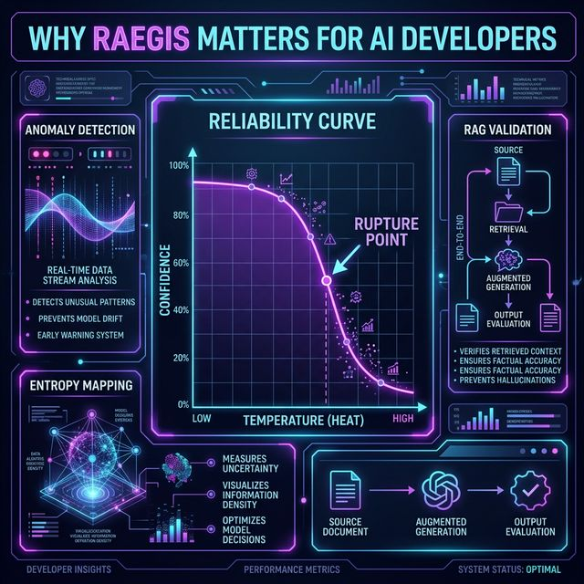

<p align="center">
  
  <br>
  
  
  
  
  
</p>

# 🩺 RAEGIS: The Stethoscope for LLMs

[](https://opensource.org/licenses/Apache-2.0)
[]()
[](https://www.tensorflow.org/js)

**Raegis Audit Protocol** is an open-source diagnostic layer for local LLMs (Gemma, Llama, Gemini). Now with **Native JavaScript (Node.js/Web)** and **TensorFlow.js** support for high-fidelity neural auditing.

Raegis tests your model by running the same prompt across a temperature ramp (e.g., `0.0` to `1.5`), measuring internal consistency (TF-IDF/Cosine) and vocabulary diversity (Shannon Entropy). With this data, it fingerprints the model’s personality, defines the **hallucination breaking point**, audits **RAG pipelines**, and compares **Personality Drift** after fine-tuning.

## Why Raegis? 🛡️

AI development is often a "black box" once you move past Temperature 0.0. Raegis provides the "Reliability Curve" that every AI engineer needs:



- **Find the Rupture Point**: Know exactly when your model starts losing its mind.
- **Audit RAG Integrity**: Quantify how much "noise" is entering your retrieval pipeline.
- **Detect Hidden Anomalies**: Identify non-deterministic hallucinations before your users do.
- **MLOps for Fine-Tuning**: If your model becomes "Overfitted" or "Destabilized" after training, Raegis will tell you exactly where it went wrong.


## Core Features

1. **Streamlit Visual Dashboard**: Track your model's behavioral heatmaps and boundaries in real-time.
2. **Anchor Test (RAG Validation)**: Measures semantic fidelity (cosine similarity via embeddings) of the model's output against a provided anchor context.
3. **Whitebox Inspector**: Extracts true token-level entropy using direct logprobs APIs (Ollama) or model tensors (HuggingFace transformers), yielding 100x faster insights than blackbox behavioral inference.
4. **Before/After Comparator**: The ultimate MLOps tool for Fine-tuning validation. Calculates the Confidence Delta and the *Personality Drift*.
5. **Guardian (Neural Autoencoder)**: Detects anomalies in high-temperature outputs using TensorFlow/Keras (with Scikit-Learn as a lightweight fallback).
6. **LLM-as-a-Judge (New in v0.1.2)**: Advanced RAG evaluation using async Faithfulness ( factual fidelity) and Contextual Precision metrics, inspired by the Ragas framework but implemented natively for privacy-first local Ollama environments.

## Installation

Raegis provides dependency tiers with optional extras tailored to lightweight or heavy-duty environments:

```bash
# Base (Lightweight, uses TF-IDF for RAG and IsolationForest for anomaly detection)
pip install raegis

# + SentenceTransformers (real deep embeddings for RAG Anchor Test)
pip install raegis[semantic]

# + TensorFlow (Keras Autoencoder for neural anomaly detection - Guardian)
pip install raegis[neural]

# All batteries included
pip install raegis[full]
```

## Streamlit Dashboard Quickstart

```bash
# In one terminal window, ensure Ollama is running:
ollama serve

# In another terminal window:
python -m streamlit run app.py
```

## 🚀 Usage (JavaScript / Node.js)

Since **v0.1.0**, Raegis is available as a native JS library with **TensorFlow.js** integration.

```typescript
import { Raegis } from './src/raegis/Raegis';

const raegis = new Raegis(YOUR_API_KEY);

// Full Audit (Temperature Sweep + Neural Anomaly Detection)
const audit = await raegis.fullAudit({
  model: "gemini-1.5-flash",
  prompt: "Audit me!",
  temperatures: [0.0, 0.7, 1.2, 1.5]
});

console.log(`Rupture Point: ${audit.rupturePoint}`);
```

### 📡 Raegis JS Audit Server
You can also run Raegis as a standalone REST API for your Gemma demos:
```bash
npx tsx src/raegis/RaegisServer.ts
```

---

## 🚀 Usage (Python API)

### 1. Behavioral Diagnostics
```python
from raegis import Auditor

auditor = Auditor(model="ollama/llama3.2")

# Audits from 0.0 to 1.5, generating N samples per temperature
report = auditor.audit(prompt="Explain machine learning with an example.", depth=3)

print("Rupture Point:", report.rupture_point)
print("Best Temperature:", report.best_temperature)

report.save("experiments/baseline.json")
```

### 2. Anchor Test (RAG Validation)
Measures the fidelity between the model's output and the retrieved ground truth.

```python
from raegis import Auditor, RaegisAnchor

auditor = Auditor("llama3.2")
anchor = RaegisAnchor(auditor)

result = anchor.test(
    prompt="What is the capital of France?",
    context="Paris is the capital and most populous city of France..."
)

# At what temperature does the fidelity drop below the threshold (0.7)?
print(result.drift_temperature) 
```

### 3. Fine-Tuning Validation
Did your base model significantly degrade after training that 6h LoRA?

```python
from raegis import Comparator

# Load the baseline JSON report you saved before training, and compare it with the new report
delta = Comparator.compare("experiments/baseline.json", report)

print(delta.verdict)             # e.g., "Overfitted", "Improved", "Destabilized"
print(delta.personality_drift)   # Normalized L2 metric measuring behavioral pattern changes
```

### 4. Whitebox / Graybox Inspector
Instead of generating multiple text responses and comparing them (blackbox inference), the Inspector directly accesses the LLM's internal token probabilities in a single forward pass.

```python
from raegis.core.inspector import WhiteboxInspector

# Graybox Mode - Natively extracts logprobs from the Ollama engine
insp = WhiteboxInspector(model_name="llama3.2", mode="graybox")

df = insp.token_entropy_curve(
    prompt="Explain the Pythagorean theorem", 
    temperatures=[0.0, 0.5, 1.0, 1.5]
)
print(df) # Exact Shannon entropy and P(top token) per temperature step

# Full Whitebox Mode - Requires mode="whitebox" (Downloads model via HuggingFace)
# Allows operations like insp.attention_snapshot() to read actual attention head maps
```

### 4. LLM-as-a-Judge (v0.1.2+)
Evaluate RAG performance with high precision using LLM-based metrics.

```python
from raegis import Auditor

auditor = Auditor("llama3.2")
pergunta = "Qual a função do Raegis?"
contextos = ["Raegis é um framework de auditoria para LLMs."]
resposta = "O Raegis é uma ferramenta de diagnóstico para modelos."

# Full evaluation (Faithfulness + Context Precision)
results = auditor.judge_rag(pergunta, contextos, resposta)

print(f"Faithfulness: {results['faithfulness']['score']}")
```

---

## Open Source Architecture

- `auditor.py` orchestrates asynchronous parallel collection;
- `anchor.py` handles RAG evaluation logic; 
- `core/judge.py` implements advanced LLM-as-a-judge metrics;
- `comparator.py` performs before/after drift analysis;
- `core/guardian.py` trains the unsupervised anomaly autoencoder on-the-fly;

The default blackbox calls are designed as lightweight REST requests strictly aimed at Ollama's default endpoint (`11434`), avoiding the immense bloated overheads associated with generic abstraction libraries like LangChain.

## Changelog

- **v0.1.2**: Initial release of **RaegisJudge**. Added support for async `Faithfulness` and `Contextual Precision` metrics. Optimized for local Ollama via `aiohttp`.
- **v0.1.1**: Initial open-source release. Behavioral diagnostics and semantic anchor tests.

## License

Apache License 2.0. See `LICENSE` for more information.

Built by **Lucas Frischeisen**. [LinkedIn](https://linkedin.com/in/rukafuu)
